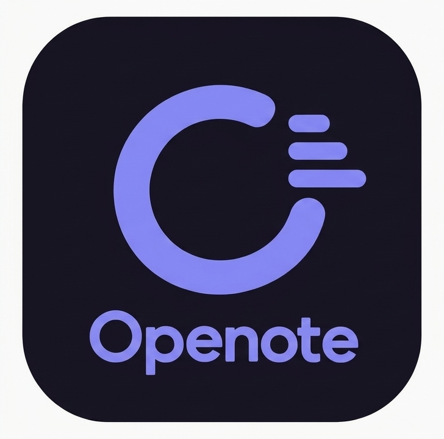

<p align="center">
  
</p>

# Openote

Openote is a local-first, freeform note-taking app for Windows. It is built
for schoolwork: write anywhere on a page, work with a pen or touchpad, keep
homework and dates together, and keep every notebook in files you control.

## What it does

- **Freeform pages** with text, handwriting, equations, tables, code, images,
  PDFs, videos and file attachments.
- **Handwriting and spell checking**: write naturally with a pen; misspelled
  words can be corrected directly where they appear.
- **Planner** for homework, reminders, exam dates and a subscribed read-only
  iCalendar timetable.
- **draw.io links**: add a diagram file to a page without copying it into the
  notebook. The original remains editable in draw.io; PNG exports can also be
  previewed and zoomed in Openote.
- **Open local storage**: notebooks live on your device. Create and restore
  complete backups from the notebook manager whenever you choose.
- **Import and export** for Markdown, PDFs and common note material.

## Deliberately not part of this project

Openote is a notes and planning app, not an all-in-one learning platform.
There is no built-in flashcard workflow and no AI or MCP integration. For
spaced repetition, use a dedicated app such as Anki; for AI, an external tool
or a future self-hosted service can work alongside your notes without being a
dependency of the editor.

## Platforms

The current project is Windows-first. Linux source support is retained.
`scanner/` contains the separate Android companion app for scanning documents.

## Run locally

Install Flutter with Windows desktop support, then run:

```powershell
cd app
flutter pub get
flutter run -d windows
```

Run the application tests with:

```powershell
cd app
flutter test
```

The optional Rust core is built automatically when Rust is available. The app
falls back to its Dart implementation if the native library is unavailable.
Further platform and release details are in [app/README.md](app/README.md)
and [docs/WINDOWS-FORK.md](docs/WINDOWS-FORK.md).

## Project layout

```text
app/                 Flutter desktop application
scanner/             Android document-scanner companion
rust/onote_core/     Optional native Rust core
docs/                Technical notes and file-format documentation
```

## Data and privacy

There is no account requirement, cloud connection or background sync. Your
notebooks remain local files. The manual backup contains the complete workspace
and can itself be stored with tools such as Nextcloud Desktop.

## License

See [LICENSING.md](LICENSING.md) for the licensing model and the individual
component licences.
